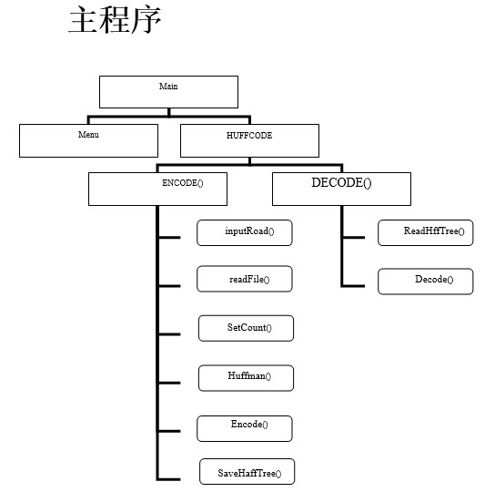
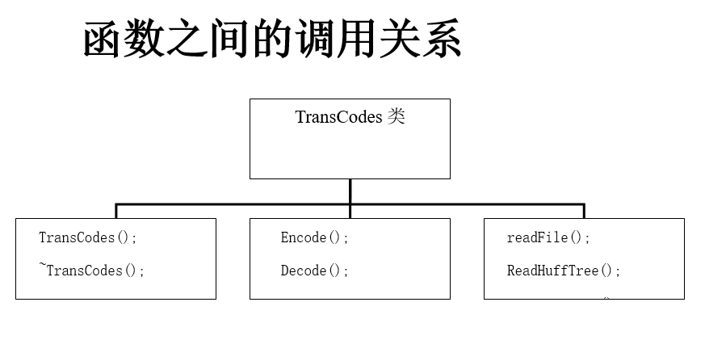
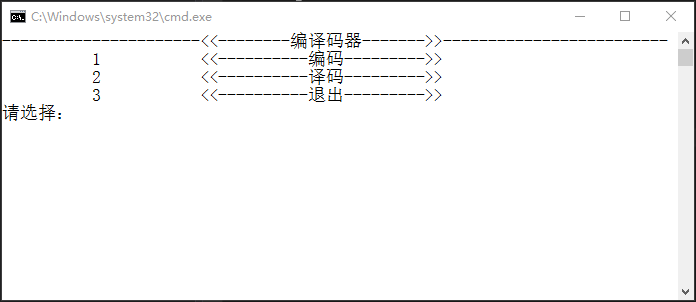
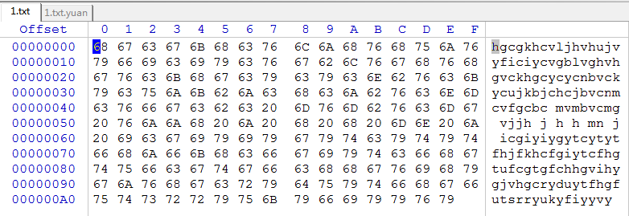
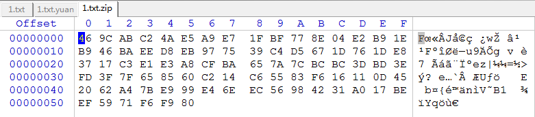
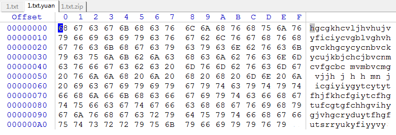

#  介绍
哈夫曼编码(Huffman Coding)，又称霍夫曼编码，是一种编码方式，通过字符的出现频率决定字符的编码长度，以此来减短字符长度，进而减小文件大小。有人称之为最佳编码，一般被称为哈夫曼编码。
哈夫曼树─即最优二叉树，带权路径长度最小的二叉树，经常应用于数据存储压缩。构造哈夫曼树是得到霍夫曼编码的极佳方法。将一组带有权值的数组通过哈夫曼算法，构造出符合该数组的编码表，即该文件的哈夫曼编码。
得到编码表后，可以通过编码表，读取任意文件，以流读取的方式，逐个解码并保存，这便是编码的原理；同样解码过程相似，将以编码后的文件流读取，
检索编码表，可得到原始编码保存。    
	这就是哈夫曼编码译码的基本原理，也是非常常见的压缩文件手段。
## 主程序 与 子程序


## 界面

## 数据分析
> 1.对比编码前的数据和编码后的二进制文件，可见文件大小缩短了将近一半，由此可以看到用哈夫曼编码来实现数据的压缩效果是非常好的。
> 2.由于时间有限，有些地方未能做的十分完善，比如对于哈夫曼树的存储，由于哈夫曼树节点本身具占有较大空余空间，所以应该对每一个节点构造协议压缩，在进行保存。
> 3.本程序将编码后的文件和哈夫曼树分开存放，但这样做在一定程度上使得哈夫曼树失去了本身的意义。可构造协议将二者写在一个数据流里面，实现文件的“打包”功能。
> 4.本程序使用的是静态构造哈夫曼树，这样较之动态构造，结构虽然简单，处理较为便捷，但存在一个很大的问题，即搜索速度非常慢，在大文件的压缩存储里缺点尤为突出。
* 细节
1.编码前  
  
2.编码后  
  
3.解码后  
 

# 功能  
1.	初始化（Initializing）  
以二进制的方式读取所要编码的文件，记录各个ascll码的权值，由这些权值构造哈夫曼树，获取编码表。  
2.	编码（Encode）  
再次以二进制方式读取所要编码的文件，根据编码表转化为哈夫曼编码，以二进制方式存于文件中。  
3.	译码（Decode）  
利用已经建好的哈夫曼树对之前的编码的文件解码，结果存于文件中。 
  
# 算法  
## 编码算法  
S1打开对应文件；  
S2以二进制流的形式读取一字节文件，查找编码表，得到编码数组，如果读到无文件，执行s4  
S3逐位将编码数组中的位放入8位二进制缓存，如果满8位，则转为16进制写入文件中，不满8位，继续读编码数组，若编码数组为空，执行S1  
S4结束   

## 译码算法  
S1打开对应文件  
S2二进制流读取文件存入8位缓存，若无文件读取，执行S4  
S3逐位读8位缓存，索引哈夫曼树，若缓存为空，则执行S2  
S4如果索引到树，则将树的内容写入文件，继续执行S3
S4结束  

## 哈夫曼生成树算法
  [1].根据给定的n个权值weight{w1,w2,...wi...wn}构成n棵二叉树的集合F = { T1 , T2 , ... Ti ... Tn}，其中每棵二叉树Ti中只有一个带权值为wi的根结点，其左右字树为空。  
       [2].在F中选取两棵根结点的权值最小的树作为左右子树构造一棵新的二叉树，且置新的二叉树的根结点的权值为左、右子树上根结点的权值之和。  
       [3].在F中删除这两棵树，同时将新得到的二叉树加入F中。   
       [4].重复[2]和[3]，直到F只含一棵树为止。到此，这最终的树即为赫夫曼树。  


## 哈夫曼编码算法
利用哈夫曼树求得的用于通信的二进制编码称为哈夫曼编码。树中从根到每个叶子节点都有一条路径，对路径上的各分支约定指向左子树的分支表示”0”码，指向右子树的分支表示“1”码，取每条路径上的“0”或“1”的序列作为各个叶子节点对应的字符编码，即是哈夫曼编码。    

# 问题与思考
1. 如何将不等长的编码接在一块并整八位输出？ 
解决方法：使用设置8位缓存的方式，即每次从硬盘中只读取一个字节，或每次只向硬盘写入8位，当这8位全部进行编译码操作后，在读取或写入下一字节。
代码如下(仅编码)：
```C++

void TransCodes::Encode()
{
	FILE *fp_read;
	FILE *fp_write;
	char tempWrite[100];
	strcpy(tempWrite, road);
	strcat(tempWrite, Suffix_zip);

	fp_read = fopen(road, "rb");
	fp_write = fopen(tempWrite, "wb");
	cout << "编码中……" << endl;
	char buffs[9];
	unsigned char buff_Read,buff_Write;
	int BuffsIndex = 0,CodeIndex;
	while (fread(&buff_Read, 1, 1, fp_read))
	{
		CodeIndex = 0;
		while (CodeIndex < strlen(TransCode[buff_Read]))
		{
			buffs[BuffsIndex++] = TransCode[buff_Read][CodeIndex++];
			if (BuffsIndex == 8)
			{
				getHex(buff_Write,buffs, 0, 7);
				fwrite(&buff_Write, 1, 1, fp_write);
				BuffsIndex = 0;
			}
		}
	}
	cout << "编码完毕！ 压缩文件已保存至"<<tempWrite<< endl;
	fclose(fp_read);
	fclose(fp_write);
}

```
2. 如何存储哈夫曼节点之间关系？  
解决方法：由于对于读文件函数的了解不深，尝试过很多解决方案，如存储其哈夫曼编码，但是在存储后读取时存在不等长字段的判断。后来想到保存哈夫曼树，因为本程序的哈夫曼树是静态哈夫曼树，所以直接用函数中的读取函数进行直接操作：
```C++
void TransCodes::SaveHuffTree()
{
	FILE *fp;
	strcat(road, codeSuffix_zip);
	fp = fopen(road, "wb");
	fwrite(myHaffTree, sizeof(HuffNode), 511, fp);
	fclose(fp);
}
void TransCodes::ReadHuffTree()
{
	FILE *fp;
	fp = fopen("e:\\2.txt.zip.codezip", "rb");
	fread(myHaffTree, sizeof(HuffNode), 511, fp);
	fclose(fp);
}
```
